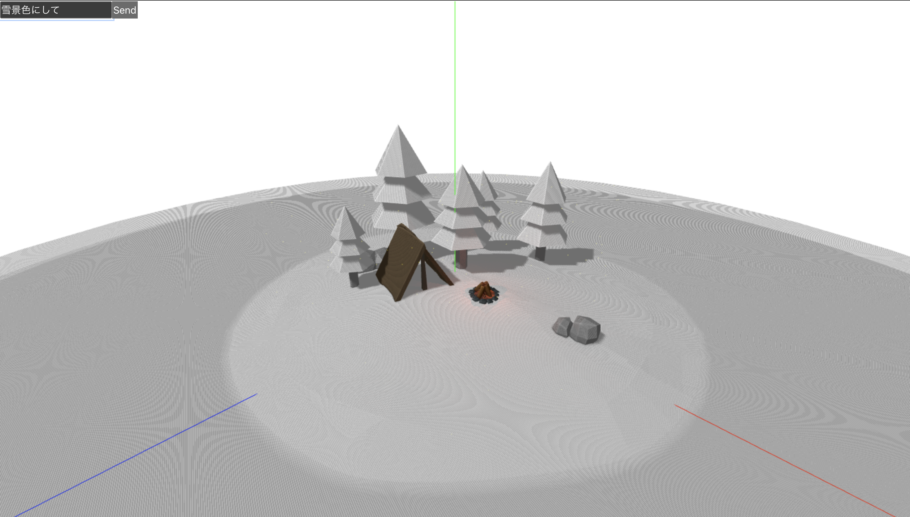
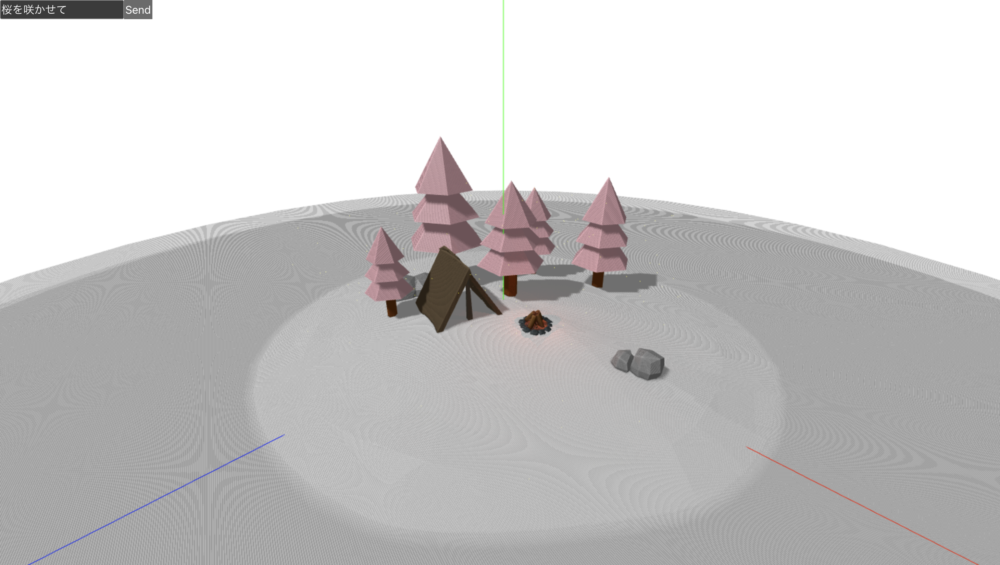

# Island

3D 表現と GPT 組み合わせたら面白そうって思ったので、対話できる島をコンセプトで作る

## イメージ

左上の入力欄に入力したプロンプト通りのイメージになるように、島の色を自動で調整します。

## Development server

LocalStorage に openAiApiKey をセットする
Run `pnpm start` for a dev server. Navigate to `http://localhost:4200/`. The application will automatically reload if you change any of the source files.
